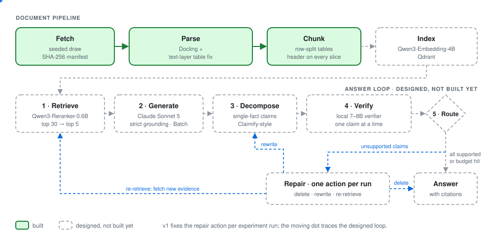

# LEDGER (Loop with Evidence-Decomposed Grounding and Error Repair)
**Question answering over US federal statistical and budget publications, designed to check every claim in its own answer against the retrieved source text before showing it.**

[](https://github.com/Vishnu-K-Menon/LEDGER/actions/workflows/ci.yml)
[](LICENSE)


> **Status, 6 October 2026: in progress.** Built and measured: the document pipeline (fetch, parse, table repair, chunking), tracing, tests and CI. Designed, not yet built: retrieval, answer generation and the claim-checking loop. Next update when the checker pilot result is in.

## In 30 seconds

- **What it is.** A retrieval-augmented generation (RAG) system over US federal budget and energy publications. The design splits each answer into single-fact claims, checks each claim against the retrieved text with a small local model, and repairs the claims that fail.
- **Measured so far.** Docling, the PDF parser, was merging rows in dense tables. A fix that rebuilds those tables from the PDF's own text was scored once, on tables it had never seen, against a 95% bar set in advance. Exact-cell accuracy rose from 30.5% to 100% in one document family and from 54% and 89% to 94.95% and 94.4% in two others, both just under the bar. Of those two, the densest was removed from version 1 rather than lowering the bar.
- **Built and next.** Built: ingestion, parsing, chunking (38 PDFs, 9,678 chunks), OpenTelemetry tracing, tests and CI. Next: the search index, then a test of whether the checking model agrees with hand labels on 50 claims. That test decides whether the design goes ahead.

## The problem

In government statistical tables the answer is a number in one cell, while its unit ("billions of dollars") and period ("fiscal year 2025") sit in a header or caption. A model can cite the right table and still report the wrong row, year or unit. The checker tests **faithfulness** (is the claim supported by the retrieved text?), not truth: a number that is wrong in the source, or misread from the PDF, passes unseen. That is why the parser work came first.

A system that deletes every claim from its answers also has 0% unsupported claims, so the results table will show **retained content** beside every unsupported-claim rate, with a "delete everything" row as a reference point.

## How it works

<!-- Put both SVGs in docs/assets/ and replace the mermaid block in "How it works" with this: --> <picture> <source media="(prefers-color-scheme: dark)" srcset="docs/assets/ledger-pipeline-dark.svg"> <source media="(prefers-color-scheme: light)" srcset="docs/assets/ledger-pipeline-light.svg">  </picture>

**Solid green boxes are built. Dashed boxes and dashed arrows are designed, not built.**

A loop like this is a textbook pattern. **The contribution is the measurement planned around it**: the checker calibrated against human labels, the claim-splitting step audited for errors, and retained content reported beside every result.
Sources: [`docs/architecture.md`](docs/architecture.md), [`configs/base.yaml`](configs/base.yaml).

## Results so far: table extraction

LEDGER answers questions from numbers in tables, so the tables have to be read correctly first. Docling, the PDF parser, merged neighbouring rows on dense government tables: 5.5% of body cells across 788 tables. The likely cause (consistent with the evidence, not proven) is that its table model resizes each table image to 448×448 pixels, which leaves about 6 pixels per text line on these pages. The fix rebuilds rows and columns from the text already inside the PDF and keeps Docling's output whenever a safety check fails.

The fix was scored once, on tables not used during development, against the publishers' own data. The bar was set beforehand: at least 95% of cells exactly right in each family, plus five other checks.

| Document family | Docling alone | With the fix | 95% bar |
|---|---|---|---|
| Economic Report of the President | 30.5% | **100.0%** | Met. 5,017 cells in 6 table files. |
| EIA Monthly Energy Review | 54.0% | **95.1%** (94.95% on the stricter count that decides) | Not met: 8 cells short, and a merged-cell check failed. Left out of version 1. |
| EIA Short-Term Energy Outlook | 89.2% | **94.4%** | Not met: all 71 misses are in one table; the other 18 are at 100%. Kept; that table is never used to write test questions. |

- Version 1 leaves out the Monthly Energy Review, the densest table family, so it may understate how hard the task is.
- Budget, Congressional Budget Office and Annual Energy Outlook tables have no publisher answer key; their parse quality is unmeasured.

Full method, the first attempt (which failed its test) and caveats: [`docs/parser_results.md`](docs/parser_results.md). Raw results: [`evaluation.json`](reports/a1_diag/rung1b/evaluation/evaluation.json).

## Engineering

- **Tests and CI.** 236 tests; 147 run in CI on a fresh clone, 89 need local data or the tokenizer.
- **Tracing.** OpenTelemetry spans (OpenInference conventions) to a self-hosted Arize Phoenix server, verified on probe calls; a traced Batch API call cost exactly half a direct call.
- **Batch job ledger.** Crash and resume behaviour tested against a fake client (12 tests); not yet run against the real Batch API.
- **Reproducible ingestion.** Seeded draws, a fetcher that obeys robots.txt and rate limits, and a manifest with a SHA-256 hash for every file.
- **Evaluation discipline.** Pass criteria written before the run, one-shot scoring on unseen tables, every outcome reported.

## Status and roadmap

- **Done.** Command-line skeleton and config; tracing; seeded draw, fetch, parse and chunk of the 38-PDF corpus; table fix built and scored once on unseen tables (results above); tests and CI.
- **Next.** Embed and index; single-shot baseline; **checker pilot on 50 hand-labelled claims (the next milestone)**; claim splitting, checking and repair; 200 paired human labels and the results table with confidence intervals.
- **After version 1.** Monthly Energy Review loaded from the publisher's spreadsheets and checked against the printed page.

Task list with checkboxes: [`docs/plan.md`](docs/plan.md).

## Quickstart

```bash
uv sync                # Python 3.12; installs Docling and PyTorch, a large download
uv run pytest          # 147 passed, 89 skipped on a fresh clone
uv run ruff check . && uv run ruff format --check .
uv run ledger --help   # lists every subcommand
```

Run on a clean clone (Linux, 6 October 2026) with no API keys and no data. `ledger ingest` needs a GovInfo API key and local data and was not run for this README; `index`, `baseline`, `pilot`, `matrix` and the other subcommands are listed in `--help` but not implemented yet.

## Limitations

- **In progress.** No answer-quality numbers exist yet. Everything measured so far is about the document pipeline.
- **Production-shaped, not production.** It has evaluations, tracing, tests and CI. It has no deployment, no scaling work and no user-facing service.
- **It checks faithfulness, not truth.** A claim counts as supported when the retrieved text supports it, even if the source itself is wrong.
- **The parser result is narrow.** It covers text-based government PDFs; one family rests on 6 table files; the Monthly Energy Review is excluded.
- **Corpus mix.** 43.4% of chunks are table chunks, below the 50–70% design range.
- **Security is out of scope for version 1.**

## Design record

- [`docs/architecture.md`](docs/architecture.md): every component with its rejected alternatives, and why this idea beat four others
- [`docs/decisions.md`](docs/decisions.md): 40 dated decisions, D-001 to D-040; the parser story is D-038 to D-040
- [`docs/evaluation.md`](docs/evaluation.md): metrics, the kappa protocol, the planned results table
- [`docs/plan.md`](docs/plan.md): tasks T1 to T18 with measured gate numbers
- [`docs/parser_results.md`](docs/parser_results.md): the parser result in full, with its caveats

**Author:** Vishnu K Menon · [github.com/Vishnu-K-Menon](https://github.com/Vishnu-K-Menon)
