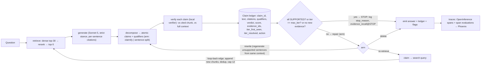

# Phase 2 — Pipeline plan for Idea 2 (claim-verify-repair with a calibrated local verifier)

Date: 2026-09-12. Constraints: 60 h (15 h/wk × 4), $200 frontier-API, ~300 hand-labels, one rented 24–40 GB GPU, correctness over latency. Locked items from Stages 2–3 are taken as given; the one disagreement with a locked item is in §9.

Every decision below: **choice / alternatives / reason / how it is measured or validated**. Sources are in §8 (reading list); inline references use the §8 numbering `[T1-3]`, `[T2-7]`, etc. Where a decision rests on no source, it says so.

---

## 1. Seven-layer decision record

### 1.1 Data layer

**D1. Corpus (LOCKED).** 100–150 US federal public-domain PDFs with tables and numbers: GAO reports, CBO cost estimates/outlooks, EIA outlook/monthly reports. Born-digital PDFs (not scans). Manifest per document: source URL, SHA-256, agency, publication date, page count. *Why it is hard:* answers are cells in multi-header tables; units and fiscal periods sit in captions and headers, not in the cell; the numeric-transcription and unit/period confusions are the hallucination modes this project measures (§1.3, D14). *Validated by:* the 10-table cell audit (D2) and retrieval recall gate (D8). *Licensing:* US government works are public domain — my inference from 17 U.S.C. §105, not a source I fetched; confirm per agency page.

**D2. Parser.** *Choice:* **Docling** (IBM, MIT) with TableFormer in accurate mode, PDF text-layer backend. *Alternatives:* PaddleOCR-VL-1.5 (Baidu, Apache-2.0, 0.9B VLM; Table TEDS 92.76 on OmniDocBench v1.5 — the highest published), MinerU2.5 / MinerU2.5-Pro (OpenDataLab, AGPL-3.0; TEDS 88.22 on v1.5; the Pro model claims SOTA 95.69 overall on v1.6), dots.ocr, Marker (TEDS 57.88; GPL-3.0 + RAIL-M weights). *Reason:* the corpus is born-digital, so the text layer contains the exact digits; a VLM parser re-OCRs a rendered page and its text edit distance (0.035 for PaddleOCR-VL-1.5 [T2-2]) is precisely the numeric-transcription risk this project is about. Docling copies digits from the text layer and only the table *structure* is at risk — which is what the audit measures. It is also CPU-fine, MIT, and its `HybridChunker` gives structure-aware chunking for free (D3). *Disagreement to know:* Docling is absent from OmniDocBench, so its table score is unmeasured on the standard suite [T2-3, secondary]; the OmniDocBench numbers are vendor-run (PaddleOCR paper, MinerU model card) and v1.5 vs v1.6 are not comparable [T2-2, T2-4]; the TII Falcon-OCR card lists MinerU2.5-Pro at 85.15 TEDS on v1.6 while OpenDataLab's own card claims a +5.54 TEDS jump — two vendors, two numbers [T2-4, T2-5]. LlamaIndex (vendor) argues OmniDocBench is saturated and misses complex financial-report tables [T2-6]. *Measured by:* **table-cell integrity audit** — 10 tables sampled across agencies (≥150 cells), each parsed cell compared to the PDF by eye; pass = ≥95% cells correct (value in the right row/column with header association). Fail → switch to PaddleOCR-VL-1.5 (config flag `parser: paddleocr_vl`) and re-run the audit; parser choice is a config value either way. A parser *sweep* is v2.

**D3. Chunking (FIXED in v1).** *Choice:* structure-aware chunking via Docling `HybridChunker`: section headings prepended to each chunk, tables kept atomic (never split; header row serialized with every table chunk; caption attached), `max_tokens: 512` measured with the embedder's tokenizer, no overlap. *Alternatives:* Anthropic contextual retrieval (LLM-written chunk context; −35% top-20 retrieval failure, −49% with BM25 [T1-8]); Jina late chunking [T2-8]; fixed-size recursive splitting; proposition chunking. *Reason:* retrieval is a held-constant, retrieval-equalized stage in this design (the comparison is between repair arms, not retrievers), so the budget should not buy retrieval gains: contextual retrieval on ~30k chunks is ~30k Haiku-class calls ≈ $15–40 of the $200, and the two third-party comparisons of contextual vs late chunking disagree with each other [T1-8 vs T2-9] — no settled winner to inherit. Heading-prepending gives a free, deterministic slice of the "context" benefit. `512` is a convention, not a measured optimum — say so in the README. *Measured by:* the retrieval recall gate (D8); no chunking sweep in v1 (kill list).

**D4. Embedding model.** *Choice:* **Qwen3-Embedding-4B** (Apache-2.0, 2560-dim, 32k context), no Matryoshka truncation. *Alternatives:* Qwen3-Embedding-8B (70.58 vs 69.45 MTEB multilingual, 2× VRAM), Qwen3-Embedding-0.6B (64.34; 1,024-dim), BGE-M3, NV-Embed-v2 (CC-BY-NC), API embedders (Gemini Embedding 2, voyage). *Reason:* best open quality that leaves room on a 24 GB card for a co-resident 7–8B verifier (4B bf16 ≈ 8 GB); the 8B's +1.1 points buys nothing in a retrieval-equalized design. *Disagreement:* one secondary source lists Qwen3-Embedding as "released early 2026, Tongyi Qianwen license, ~75.1 MTEB v2" [T2-11]; the model card and paper say June 2025, Apache-2.0, 70.58 [T2-10]. The primary source wins; the discrepancy is an aggregator error. *Measured by:* recall gate (D8). Dimension truncation is v2.

**D5. Vector store.** *Choice:* **Qdrant** in local (embedded, no server) mode, with a sparse BM25 vector configured but disabled by default. *Alternatives:* pgvector (needs a running Postgres; most-named in postings), LanceDB (embedded, Arrow-native), Chroma, Milvus. *Reason:* ~30k vectors makes every option equivalent on quality; the differentiators are zero-setup (local mode), native hybrid dense+sparse for the D8 fallback, and payload filters for `doc_id`/`table` metadata. pgvector loses on one extra service in a 60-hour project; note in the README that the swap is one adapter. *Measured by:* not a measured variable; validated by index build + recall gate.

**D6. Index freshness — DECISION (was DELETED–side-effect).** Out of scope for v1: the corpus is a frozen snapshot pinned by manifest hash; nothing changes during the experiment, so incremental ingestion would add code with no measurement behind it; a re-index is a full rebuild (minutes). Recorded in `docs/decisions.md`.

**D7. Provenance / trust.** Single tier (all documents are agency-published); provenance metadata (agency, URL, date) is stored on every chunk and surfaced in citations. Trust weighting is the Idea 3 borrow (v2, locked).

### 1.2 Retrieval layer (FIXED, retrieval-equalized)

**D8. Search method and budget.** *Choice:* dense top-30 → **Qwen3-Reranker-0.6B** (Apache-2.0) → top-5 into context. Hybrid (dense + BM25, RRF) only if the recall gate fails. *Alternatives:* Qwen3-Reranker-4B (VRAM), BGE-reranker-v2-m3 (Apache-2.0; classic cross-encoder), no reranker. *Reason:* the reranker's job is to make top-5 recall high enough that the unsupported-claim rate reflects generation, not retrieval misses; the 0.6B reranker costs 1.2 GB. Integration caveat: Qwen3-Reranker is a yes/no LM scorer, not a drop-in cross-encoder; use the official scoring snippet [T2-12]. *Measured by:* **recall gate** — recall@5 of the gold chunk on the 200-question set ≥ 0.85 and MRR reported. Below 0.85 → enable hybrid; below 0.75 after hybrid → raise top-k to 8 and re-check. Re-retrieval (D17) reuses this exact retriever with a claim-derived query, so all arms see the same retriever.

**D9. Metadata filtering.** None at query time in v1. Filters (`agency`, `is_table`) exist for the demo and failure analysis only.

**D10. Query rewriting.** None on the first pass (strict retrieval-equalized baseline). In the re-retrieve arm, the unsupported claim itself is rewritten into a search query by the generator (D11) — the only rewriting in the system, and it is the treatment.

### 1.3 Generation layer

**D11. Generator and local/API split.** *Choice:* **Claude Sonnet 5** via the **Batch API** for generate / decompose / rewrite (all experiment runs are offline); local models for embed, rerank, verify, and the secondary judge. *Pricing verified today [T2-1]:* Sonnet 5 $2 in / $10 out per MTok, Batch $1 / $5; Haiku 4.5 $1 / $5 (Batch $0.50 / $2.50); Opus 5 $5 / $25. Sonnet 5 uses the newer tokenizer (~30% more tokens for the same text) — included below. *Alternatives:* Haiku 4.5 (cheaper; a weaker generator inflates the baseline unsupported rate, making the effect larger but less representative), Opus 5 (over budget), a local 8B generator (free; same objection as Haiku, plus a weaker decomposer, which is the one step whose errors contaminate everything). *Budget arithmetic:* ≈30k tokens/query across all arms (Stage 3 model) × 1.3 tokenizer = 39k; 150 questions × 3 seeds = 17.6M tokens, ~90% input → Batch ≈ $16 + $9 = **$25 per full matrix**, graft cells ≈ +$3, dev iteration ×1.5 → **≈ $45**; if Batch is not used ≈ $90. Question generation and audits are local. Projected total **$50–100 of $200**. *Measured by:* tokens and $ per query recorded from usage fields on every span (D24); A7 in §6 checks the projection in week 1.

**D12. System prompt and grounding stance — STRICT, decided.** The generator answers only from the retrieved chunks; every sentence carries citations `[c#]` to chunk IDs; if the chunks do not contain the answer it must return the abstention schema (`answerable: false`, reason) rather than answer from parametric knowledge; numbers must be copied verbatim with unit and period as printed. *Alternative:* permissive (allow parametric knowledge, label it) — rejected because the measured quantity is faithfulness to context and a permissive stance confounds "unsupported" with "true but not in context" (Stage 1 T4: faithfulness ≠ correctness). *Measured by:* abstention rate on the 20 unanswerable control questions (target ≥ 90%) and on answerable questions (target ≤ 5%); parametric-leakage rate = unsupported claims that a judge marks world-true (reported, from the labeled subset).

**D13. Structured output and schema validation.** All generator outputs are JSON validated by pydantic: `Answer{sentences[{text, citations[]}], answerable, abstain_reason}`, `Claim{claim_id, text, source_sentence_idx, citations[], qualifiers{entity, unit, period}}`, `Verdict{claim_id, label, score, evidence_ids, cited_support: bool}`. Validation failure → one retry with the error appended → fallback (sentence-split decomposition, or `delete` repair) with `fallback=true` logged and counted as a decomposition error (D15). Malformed claim IDs are dropped and logged.

**D14. Expected hallucination modes and mitigations (project-specific).**

| Mode | Mitigation | Where measured |
|---|---|---|
| Numeric transcription (wrong cell / row-column slip) | Text-layer parser (D2), atomic table chunks with header row (D3) | Verifier + human labels; numeric exact-match on gold |
| Unit / period confusion (millions vs billions, FY vs CY) | Claims carry `qualifiers{unit, period}`; strict prompt "copy as printed" | Decomposition audit; human labels |
| Parametric leakage (true in the world, absent from context) | Strict stance (D12); abstention schema | Leakage rate on labeled subset |
| Aggregation (sums/comparisons not literally present) | Verifier marks unsupported; `rewrite` arm must cite constituents | Repair-arm results |
| Wrong citation (claim supported by another chunk) | Two-level verification: vs cited chunk and vs full context | Citation accuracy (D21) |

**D15. Decomposition — a MEASURED stage (mandate 1).** *Choice:* Claimify-style extraction [T1-6]: the generator emits atomic, decontextualized claims, each tied to a source sentence and carrying `qualifiers`. *Baseline arm:* sentence-split — each answer sentence is one claim, no decontextualization. *Alternatives:* FActScore atomic facts (no decontextualization), VeriScore (verifiable-only), DnDScore's joint decontextualization [T3-4], TriQua hyperrelational facts [T3-5, <60 days]. *Reason:* Claimify ships the evaluation framework we need to measure decomposition itself. *Measured by:* **decomposition audit** — 50 answers (25 from the baseline run, 25 from the re-retrieve arm's final answers; stratified table/prose), every extracted claim scored on three checks: *entailed* (claim adds nothing beyond the answer), *decontextualized* (standalone: entity, unit, period present when the sentence had them), *coverage* (every factual proposition in the answer appears in some claim; scored per answer). Reported: per-claim error rate = share of claims failing entailed∧decontextualized; per-answer coverage; the same for sentence-split. Every downstream number is reported with the decomposition error rate beside it. Item budget: 50 audits ≈ 4 min each ≈ 3.5 h.

**D16. Citation generation vs verification.** Generate per-sentence citations, then verify at two levels: claim vs *cited* chunk(s) (`cited_support`) and claim vs *full* retrieved context (`support`). Citation accuracy = P(cited_support | support).

**D17. Context engineering.** Context per generation call = top-5 chunks (≈2.5k tokens) + question; re-retrieval appends new chunks only (dedup by chunk ID) up to a hard cap of 12 chunks; older evidence is never pruned in v1 (the loop is 1–3 iterations). No chain-of-thought is requested from the generator (numbers must be copied, not reasoned); decomposition and rewrite are separate calls. Rationale: Chroma's context-rot result [T3-2] argues against stuffing; the cap makes the loop's cost bounded and measurable.

**D18. Quantization — REVISED 2026-09-12 (see docs/decisions.md D-012).** Embedder bf16; **verifier bf16, always.** The AWQ-int4 path is removed: the environment is a g6e.xlarge (L40S, 48 GB nominal, 44.7 GiB reported), so there is no 24 GB branch. The κ pilot and the full matrix therefore run in the same precision trivially. No Matryoshka truncation (D4).

**D19. Fine-tuning.** Not required: the chosen verifier family reaches GPT-4-level grounded-factuality accuracy off the shelf [T1-4]; fine-tuning the verifier on the 200 labels is v2, and doing it in v1 would destroy the κ measurement (test-on-train).

### 1.4 Agent layer

**D20. Workflow shape and framework.** *Choice:* single agent, conditional-iterative graph in **LangGraph**, state = the claim ledger (typed dict), checkpointed per node. Nodes: `retrieve → generate → decompose → verify → route`; `route` sends to `emit` (all supported / budget hit) or to the repair node for the arm (`delete` / `rewrite` / `re_retrieve`); `re_retrieve` loops back to `retrieve` with claim-derived queries. *Alternatives:* plain Python loop (fewer hours, full control), Pydantic AI, LlamaIndex Workflows. *Reason:* the graph *is* the loop, checkpoints give resumable runs for free, and LangGraph is named in three of four Stage 1 T6 postings; cost is ~2 h of overhead. *Honest note for the README:* in v1 the repair action is a fixed arm per experiment cell, not a runtime choice — the agentic content is the loop-back edge, the stop rule, and the externalized ledger.

**D21. Tools and schemas.** `retrieve(query: str, k: int) -> [Chunk]`; `verify(claim: Claim, evidence: [Chunk]) -> Verdict` (local model); `rewrite_query(claim) -> str` and `regenerate(question, chunks, ledger) -> Answer` are LLM calls, not tools. The ledger row: `{claim_id, text, source_sentence_idx, citations, qualifiers, verdict, score, evidence_ids, iter_first_seen, iter_resolved, action_taken}`.

**D22. Stop rule and budgets (decided).** Stop when **(a)** every ledger claim is SUPPORTED, or **(b)** `iter == max_iter`, or **(c)** *no progress*: re-retrieval returned no chunk not already in context. On (b)/(c) with claims still unsupported, apply the arm's terminal action (delete for re-retrieve arm; the answer is emitted with a "could not verify" flag per dropped claim) and log `stop_reason`. Hard caps: `max_iter` (arm value; v1 = 1; graft cells 2 and 3), `max_tool_calls: 12`, `max_context_chunks: 12`, `max_tokens_per_query: 60000`. Rationale: (a) is the claim-sufficiency stopping idea from the S2G-judge line [T3-6]; (c) is the cheap no-progress guard the Stage 1 stopping literature converges on. *Measured by:* evidence-recall-at-STOP (Idea 1 graft, locked): fraction of questions whose gold chunk is in context at STOP, by `max_iter`; plus `stop_reason` distribution and mean iterations.

**D23. Error handling and escalation.** Schema failures per D13. Verifier failures (OOM/timeout) → retry once → mark claim `UNVERIFIED` and route to terminal action. Retrieval returning <3 chunks → proceed and flag. Any query exceeding caps → emitted with `budget_exhausted=true`; counted in the failure taxonomy (D27). No human escalation path in v1.

### 1.5 Evaluation layer

**D24. Eval-set construction.** 200 questions generated by a **local Qwen3-8B** (different family from the generator and from the verifier, to avoid same-model circularity) from randomly sampled chunks: 60% table chunks, 40% prose chunks; each item = `{question, gold_answer, gold_chunk_id, answer_type ∈ {number, short_phrase}}`. Automatic filters: gold answer string present in gold chunk; no near-duplicates (embedding cosine > 0.9); numeric answers must be copyable as printed. Human validation: 50 items (answerable, gold correct, unambiguous). Plus **20 unanswerable controls** (entities/periods absent from the corpus; checked by retrieval top-5 not containing the answer; all 20 human-checked). Use 150 answerable + 20 controls; keep spares. Chunking is frozen *before* generation so gold chunk IDs are stable (the graft depends on it).

**D25. Metrics.**
- Retrieval: recall@5, MRR of gold chunk (gate D8).
- Faithfulness: **unsupported-claim rate** per arm (verifier), and **human unsupported rate** on the labeled subset.
- Verifier calibration: **Cohen's κ** verifier-vs-human on 200 claims — **100 from baseline answers, 100 from the re-retrieve arm's final answers, drawn from the same 100 questions and paired** (accepted with refinement, docs/decisions.md D-010): pairing cancels between-question variance so the CI on X−Y, the number actually reported, tightens at no extra label cost. Labels are three-class (SUPPORTED / PARTIAL / UNSUPPORTED, D-003); the primary κ is binary with PARTIAL folded into UNSUPPORTED; three-class κ and the partial rate are reported separately and marked not comparable. Also verifier FP/FN, AUROC on score.
- Decomposition error (D15).
- Citation accuracy (D16).
- **Retained content** (mandate 3): claims retained / baseline claims; answer tokens ratio; gold-answer coverage by judge.
- Answer correctness: numeric exact-match vs gold for `number` items (free), judge score for `short_phrase` (local Qwen3-8B, rubric, different family).
- Agentic: evidence recall@STOP, iterations, tool calls, `stop_reason` mix, tokens and $ per query.
- Abstention on controls / answerables (D12).

**D26. Baselines and ablations — results table (mandate 3).** Rows: `no-repair` · `delete-all` (trivial: 0% unsupported, 0 retained; computed from the no-repair run) · `delete` · `rewrite` · `re-retrieve(1)` · `re-retrieve(2)`* · `re-retrieve(3)`* — each × decomposition ∈ {claimify, sentence-split} except the * graft cells (claimify only). Columns: unsupported rate (verifier) · unsupported rate (human, where labeled) · retained content · correctness · citation accuracy · evidence recall@STOP · iterations · tokens/query · $/query. Every rate with a 95% CI: bootstrap over questions, and mean ± sd over 3 sampled runs (generation `temperature: 0.3`; the API has no seed parameter, so "seed" means an independent sampled run). **Seed 1 runs alone first; seeds 2 and 3 are submitted only after its outputs and ledgers have been inspected (D-009).** The `delete` arm emits a visible `[unverified claim removed]` marker in the answer text; the marker is excluded from the retained-content measurement (D-008). Method split: automated for rates; human labels for calibration; the local judge for correctness/retained content; no RAGAS in the core table (one comparison row allowed if <1 h, per the Stage 3 kill list).

**D27. Failure taxonomy (for root-cause attribution).** `R` retrieval miss (gold chunk not in context) · `D` decomposition error · `V-FP`/`V-FN` verifier vs human · `G` generation unsupported with evidence present · `C` wrong citation · `P` repair regression (rewrite/regenerate introduced a new unsupported claim) · `S` stop-rule miss (stopped with unsupported claims and evidence available) · `B` budget exhausted. Every labeled disagreement gets one code.

**D28. Regression testing and CI.** GitHub Actions on every push: unit tests for schemas, ledger invariants (a claim cannot be SUPPORTED with empty `evidence_ids`; `iter_resolved ≥ iter_first_seen`), stop rule, config loading. On demand: a 20-question smoke eval (≈ $0.50) writing `metrics.json`; fails if unsupported rate or evidence recall@STOP moves beyond a tolerance set from the week-4 run. CI is first on the cut list (§5).

### 1.6 Operations layer

**D29. Tracing (mandate 5) — REVISED 2026-09-12 by D-014 (see docs/decisions.md).** *Choice:* OpenTelemetry over OTLP with **OpenInference semantic conventions** (`openinference.span.kind`, `llm.*`, `retrieval.*`, `tool.*`), exported to **Arize Phoenix, self-hosted on a t3.medium** (2 vCPU / 4 GiB — D-015; the t3.small in D-014 was revised), single container. The OTLP endpoint is read from `OTEL_EXPORTER_OTLP_ENDPOINT`; instrumentation lives behind one module (`tracing/otel.py`) so the convention set is swappable. *Rejected (direction reversed from the original D29):* `gen_ai.*` — still Development with no tagged release as of Aug 21 2026 after moving to `open-telemetry/semantic-conventions-genai` on Jun 12 2026 [T2-16a, T2-16b]; pinning it means pinning an unreleased spec. Langfuse Cloud Hobby (hard 50k-unit cap — the matrix alone is ~90k units), Langfuse Cloud Core ($29/mo real money), Langfuse self-hosted (six containers, ~$60/mo of credits), Opik (fine, more containers for no gain) — reasons in D-014. LangSmith (LangChain-tied); Jaeger (no LLM UI). *Span plan (shape retained from the original D29, names mapped):* root span per query, kind `AGENT`, `input.value` = question, plus attributes `rag.question_id`, `rag.arm`, `rag.seed`, `rag.iter`, `rag.stop_reason`, `rag.cost_usd`; one `LLM`-kind span per generate / decompose / rewrite call with `llm.provider`, `llm.model_name`, `llm.invocation_parameters`, `llm.input_messages`, `llm.output_messages`, `llm.token_count.prompt`, `llm.token_count.completion` (cache-read/write tokens under `llm.token_count.prompt_details.*` — verify the exact key against the pinned `openinference-semantic-conventions` version); one `RETRIEVER`-kind span per `retrieve` with `input.value` = query and `retrieval.documents.{i}.document.{id,score}`, followed by a `RERANKER`-kind span with `reranker.top_k` and output document ids; one `TOOL`-kind span per verify call with `tool.name="verify"`, `rag.claim_id`, `output.value` = the Verdict JSON; one **evaluation record per verdict**, set **inline** on the open verify span as `evaluations.0.evaluation.{name="claim_support", label, score, explanation=evidence_ids JSON, annotator_kind="LLM", identifier=<verifier>@<revision>, metadata={claim_id, input_mode, threshold, cited_support}}` via `openinference-instrumentation`'s `get_evaluation_attributes` (D-017); human labels and re-scoring go **post-hoc** as `EVALUATOR` carrier spans with exactly one Span Link to the target verify span, emitted over OTLP by `eval/trace_annotate.py` — no Phoenix client anywhere (D-017). Pins: `openinference-semantic-conventions==0.1.29`, `openinference-instrumentation>=0.1.57`. `PROMPT` span kind not adopted in v1. *Measured by:* A5 in §6 — the first traced call in week 1 must render in Phoenix with token counts. If OpenInference attributes do not render as expected, take the D-014 escape hatch: switch the OTLP endpoint to Langfuse Cloud Core and keep the OpenInference instrumentors. Decide in week 1, not week 4.

**D30. Metrics tracked in the backend.** Per query: retriever latency, chunks in context, verifier latency, tokens, cost, iterations, stop reason. Per run: the D25 table. Cost per query is computed from usage fields, not estimated.

**D31. Config (mandate 4).** All parameters in `configs/*.yaml` validated by pydantic: `parser`, `chunking.max_tokens`, `embedding.model`, `retrieval.{k_dense, k_final, hybrid}`, `reranker.model`, `generator.{model, temperature, batch}`, `decomposition.method ∈ {claimify, sentence_split}`, `verifier.{model, precision, threshold}`, `repair.action ∈ {none, delete, rewrite, re_retrieve}`, `loop.{max_iter, max_tool_calls, max_context_chunks, max_tokens}`, `seeds`. `experiments/matrix.yaml` expands to the 8 + 2 cells × 3 seeds; `run_matrix.py` submits Batch jobs **one seed at a time** and writes one `results/<cell>/<seed>.jsonl`. Also in config: `vector_store.mode` (the Qdrant client is constructed in exactly one place, D-002); `verifier.input_mode ∈ {concatenated, per_chunk_max}` (fixed by the pilot, D-004); `judge.model` **and `judge.revision`** — the exact Hugging Face revision hash, pinned once chosen and never changed mid-project (D-007). Hydra was considered and rejected (multirun is nice; the learning cost is not worth it at 60 h — convention, no source).

### 1.7 Security layer — DECISION (was DELETED–side-effect)

Out of scope for v1: the corpus is a single-writer, frozen snapshot of agency-published PDFs with no untrusted ingestion path, so corpus poisoning and instruction injection via retrieved documents have no attack surface to measure; the v2 borrow (cross-source support count + 20-document numeric-manipulation set) is the first security row, and RAGShield's Proposition 1 [T1-7] is the reason a faithfulness verifier alone would not count as one. Recorded in `docs/decisions.md`.

---

## 2. Runtime loop diagram

Repo-portable Mermaid (renders on GitHub; paste into `docs/architecture.md`). Figma is connected and I can push this same diagram to a FigJam board on request.

Notes on the loop: `rewrite` re-enters at `decompose` because a rewritten sentence must be re-decomposed and re-verified; `re-retrieve` re-enters at `retrieve` with one query per unsupported claim, then regenerates from the enlarged context. The ledger persists across iterations; a claim's `iter_resolved` is the iteration at which it turned SUPPORTED.

---

## 3. Experiment matrix — variables vs constants

| Component | Status | Value(s) |
|---|---|---|
| Corpus, parser, chunking, embedder, index, reranker, top-k | **Constant** | D1–D5, D8 |
| Generator, temperature, prompt (strict) | **Constant** | Sonnet 5, T=0.3, D12 |
| Verifier, precision, threshold | **Constant** (chosen by κ pilot) | D32 |
| **Decomposition method** | **Variable A** | `claimify`, `sentence_split` |
| **Repair action** | **Variable B** | `none`, `delete`, `rewrite`, `re_retrieve` |
| **max_iter** (graft) | **Variable C** (re_retrieve × claimify only) | 1 (in B), 2, 3 |
| Seeds | Repeats | 3 independent sampled runs |
| `delete-all` | Derived row | computed from `none` |

Cells: A(2) × B(4) = 8, + C(2) = 10 cells × 3 seeds = 30 runs × 150 answerable + 20 control questions. Initial generation is shared within a seed across arms (same question, same first answer), so arms differ only in what happens after the first `verify`.

---

## 4. Build order — 60 hours

**Week 1 — index, baseline, go/no-go (15 h)**
1. Repo scaffold (`uv run ledger --help` CLI skeleton); pydantic config + YAML; OpenInference exporter via `tracing/otel.py`, OTLP endpoint from the environment → Phoenix on the t3.medium (D-014, D-015); first traced API call visible with token counts — **2 h**
2. Corpus: 100–150 PDFs from GAO/CBO/EIA with manifest (URL, hash, agency, date) — **3 h**
3. Docling parse (TableFormer accurate); **10-table cell audit** (A1) — **3 h**
4. HybridChunker (tables atomic, headings prepended, 512 tok); Qwen3-Embedding-4B; Qdrant local; freeze chunk IDs — **3 h**
5. Single-shot baseline: strict prompt, structured output, Batch client; 25 draft questions; recall spot-check (A6) and budget projection (A7) — **2 h**
6. **κ pilot** (§7): 50 claims labeled; Bespoke-MiniCheck-7B and Granite Guardian 3.3 scored in run precision; κ — **2 h**

**Week 2 — questions, decomposition, verifier, two arms (15 h)**
7. Question set: 200 generated locally (Qwen3-8B), filters, 50 hand-validated; 20 unanswerable controls; recall gate on all 200 (D8) — **3 h**
8. Decomposition node (Claimify-style structured output) + sentence-split baseline; **decomposition audit, first 25 answers** (D15) — **4 h**
9. Verifier node: two-level verification, verdict schema, evaluation events; threshold fixed from pilot — **3 h**
10. `delete` and `rewrite` arms; ledger invariants + unit tests — **4 h**
11. Trivial baseline computation (`delete-all`) and retained-content metric — **1 h**

**Week 3 — the loop, the labels (15 h)**
12. LangGraph graph with checkpoints; `re_retrieve` arm (claim → query → retrieve → regenerate → re-verify); stop rule; caps; `stop_reason`; **evidence-recall@STOP** (Idea 1 graft, locked) — **6 h**
13. Claim labeling: 200 claims (100 baseline / 100 post-re-retrieve, same questions) — **8 h**
14. Matrix runner (`matrix.yaml` → Batch jobs → `results/`) — **1 h**

**Week 4 — runs, numbers, README (15 h)**
15. Run 10 cells × 3 seeds via Batch; local verification and local judge over all outputs; second half of the decomposition audit (25 post-repair answers) — **4 h**
16. Analysis: D26 table with CIs; κ on 200; decomposition error; citation accuracy; evidence recall@STOP by `max_iter`; failure taxonomy on all human/verifier disagreements — **5 h**
17. README with the numbers and the caveats (fixed arms; 512 convention; OpenInference-not-`gen_ai.*` with the Aug 2026 date, D-014); CLI/notebook demo; `docs/decisions.md`; smoke-eval CI — **4 h**
18. Slack — **2 h**

Label budget: 50 pilot claims (reused inside the 100 baseline claims) + 150 further claims + 50 question validations + 20 control checks + 50 decomposition audits = **300 items** (pilot claims are not double-counted).

---

## 5. What to cut first if week 3 runs over (in order)

1. **Graft cells `max_iter` 2 and 3** → keep `re_retrieve(1)` only. Saves ~3 h and ~$3. Evidence-recall@STOP is still reported at `max_iter=1` (the graft metric survives; its sweep does not).
2. **Sentence-split decomposition *arm*** → halves the matrix (5 cells). Saves ~2 h. The decomposition *audit* stays — mandate 1 is not cuttable; only the ablation is.
3. **Seeds 3 → 2.** Saves ~1 h and ~$10; CIs widen — say so in the README.
4. **Claim labels 200 → 150** (75/75). Saves ~2 h; κ CI widens from roughly ±0.10 to ±0.12 (estimate).
5. **Smoke-eval CI** → v2 (unit tests stay).
6. **`rewrite` arm** → keep `delete` and `re_retrieve` (the two ends of the retained-content tradeoff).

Never cut: `no-repair` and `delete-all` rows, the decomposition audit, κ, tracing from commit one, the strict-stance controls.

---

## 6. Assumptions to validate in week 1 — cheapest falsification

| # | Assumption | Test | Hours | If false |
|---|---|---|---|---|
| A1 | Docling table-cell integrity ≥ 95% on born-digital agency tables | 10-table audit (≥150 cells) | 1.0 | `parser: paddleocr_vl`, re-audit |
| A2 | Local verifier κ ≥ 0.5 vs my labels | §7 pilot | 2.0 | Stage 3 switch to Idea 3 |
| A3 | Baseline unsupported-claim rate ≥ 8% (effect measurable) | prevalence in the 50 pilot claims + verifier rate on 25 answers | 0.3 | harder questions (multi-cell, cross-table); if still < 5%, use Haiku 4.5 as generator and say why |
| A4 | Sonnet 5 Batch returns schema-valid JSON ≥ 98% | 25 draft calls | 0.5 | forced tool-use schema; retry policy |
| A5 | On the first traced call, with `openinference-semantic-conventions==0.1.29` / `openinference-instrumentation>=0.1.57` pinned: spans render in Phoenix with token counts; an inline `evaluations.*` verdict shows in the verify span's Evaluations panel; a post-hoc `EVALUATOR` carrier with one Span Link renders against the linked verify span (D-014, D-017) | one traced query + one carrier | 0.5 | spans fail → escape hatch: OTLP to Langfuse Cloud Core, same instrumentors; carrier fails to render → D-017 successor: keep the wire form, add a Phoenix-side display import — decide in week 1 |
| A6 | Retrieval recall@5 ≥ 0.85 on draft questions | 25 draft questions | 0.5 | enable hybrid BM25 |
| A7 | Full matrix ≤ $120 projected from measured tokens/query | 25 draft queries × matrix | 0.2 | drop to Batch-only; cut graft cells |
| A8 | Embedder 4B (bf16) + reranker 0.6B + verifier 8B (bf16) fit the L40S (~25 GB of weights on 44.7 GiB usable) | load all three, run one verify call, read `nvidia-smi` | 0.2 | 0.6B embedder first; if still short, run the verifier and judge in separate stages (never quantize — D18) |

---

## 7. Week-1 go/no-go — the κ pilot, precisely

**What is labeled.** 50 *claims*, each a `(claim, retrieved_context)` pair from the single-shot baseline, labeled three ways — **SUPPORTED / PARTIAL / UNSUPPORTED** — *against the retrieved context only* (faithfulness, not world truth). The **primary κ is binary**, PARTIAL folded into UNSUPPORTED, because the route step has no third branch (D-003). The partial rate and a three-class κ are reported separately, marked not comparable to the binary figure; a high partial rate feeds the D15 analysis (claims too coarse to verify cleanly). Labeling time ≈ 2.5 min/claim ≈ 2 h.

**How the 50 are sampled.** Run the baseline on 25 draft questions (13 table-derived, 12 prose-derived). Decompose with the Claimify-style prompt (~5 claims/answer ≈ 125 claims). Stratified random sample of 50: 25 from table-derived answers, 25 from prose; at most 3 claims per answer; **not** stratified by verifier score (that would bias κ). Fix the random seed and commit the sample IDs.

**What is scored.** Both candidate verifiers, in the precision they would run in (D18): **Bespoke-MiniCheck-7B** (top of LLM-AggreFact at 77.4 BAcc; non-commercial license, commercial by agreement [T2-17]) and **Granite Guardian 3.3 8B** (76.5 on the same benchmark per IBM's card; Apache-2.0 [T2-18]); MiniCheck-Flan-T5-Large (75.0; 0.8B) as the CPU fallback. Each verifier is scored **twice**: with the concatenated top-k context as input, and with per-chunk scoring taking the max over chunks (D-004). **Tie-break, fixed before the pilot runs and not revised after seeing results: if the two input modes are within 0.05 κ, take concatenated** (simpler, fewer verifier calls). Cohen's κ per verifier × input mode at the default threshold; also AUROC on the score.

**Branches.**
- **κ ≥ 0.6 on either** → GO with the higher-κ verifier; threshold stays at default; the pilot's 50 labels join the week-3 100 baseline labels.
- **0.5 ≤ κ < 0.6** → GO with the higher; tune the threshold on the pilot, and report final κ only on the week-3 labels (never on the pilot).
- **Both < 0.5** → inspect the 10 largest disagreements. If ≥ 5 are labeler errors, relabel once and recompute. Otherwise the local-verifier premise fails: execute the Stage 3 conditional switch to Idea 3, reusing the corpus, index, config, and tracing work (≈ 11 h salvaged).
- **A3 side-check:** if fewer than 4 of the 50 claims are UNSUPPORTED, the effect will be unmeasurable at n=750 — harden the question set before week 2.

---

## 8. Reading list

Tiers: **PRIMARY** = paper, official doc, model card, spec. **SECONDARY** = blog, vendor post, practitioner write-up (vendor named). Links marked **(canonical, not fetched)** are constructed from a known ID or product path and were not opened in this session; all others were returned by a search or fetch today or in Stages 1–3. Items published in the last ~60 days are flagged **[<60 days]**.

### TIER 1 — read first, in this order

**[T1-1] FinGround** — arXiv:2604.23588, Apr 2026 (authors not re-verified today; see abstract page). PRIMARY. https://arxiv.org/abs/2604.23588 (canonical, not fetched). *Take:* the retrieval-equalized evaluation design — every arm sees the same retrieved evidence, so the comparison isolates the repair. *Ignore:* the finance corpus and its −68% number as a target; it is a different question distribution.

**[T1-2] Detecting and Repairing Hallucinations in Retrieval-Augmented Generation** — Mulakkayala, van Stein, Plaat; arXiv:2608.29307, Aug 29 2026. PRIMARY. **[<60 days]** https://arxiv.org/abs/2608.29307 (canonical, not fetched); machine review with the density/human-label critique: https://pith.science/paper/2608.29307. *Take:* delete beats rewrite on judged hallucination but retains less text — the reason retained content is a required column — and their own admission of low judge agreement and no human labels. *Ignore:* their absolute numbers (RAGTruth, different detectors).

**[T1-3] FaithBench** — Bao et al. (Vectara-led), NAACL 2025; arXiv:2410.13210. PRIMARY. https://arxiv.org/pdf/2410.13210. *Take:* why detectors sit near 50% on the hard/disagreement cases — the reason κ is measured on *our* claims and not assumed from a leaderboard. *Ignore:* the summarization framing; our claims are QA.

**[T1-4] MiniCheck: Efficient Fact-Checking of LLMs on Grounding Documents** — Tang, Laban, Durrett; EMNLP 2024; arXiv:2404.10774. PRIMARY. https://arxiv.org/pdf/2404.10774; code https://github.com/Liyan06/MiniCheck. *Take:* the (document, claim) → supported/unsupported task definition and the cost/accuracy claim (770M ≈ GPT-4 at ~400× lower cost). *Ignore:* the RoBERTa/DeBERTa variants; use the FT5 fallback or Bespoke/Granite (Tier 2).

**[T1-5] Agentic RAG SoK, §F "Retrieval-Grounded Self-Verification Pattern"** — arXiv:2603.07379, Mar 2026. PRIMARY. https://arxiv.org/abs/2603.07379 (canonical, not fetched). *Take:* the pattern is now textbook; our contribution is measurement (κ, decomposition error, re-retrieve as a repair action), and the README should say that. *Ignore:* the rest of the SoK for v1.

**[T1-6] Towards Effective Extraction and Evaluation of Factual Claims (Claimify)** — Metropolitansky & Larson (Microsoft); arXiv:2502.10855, Feb 2025. PRIMARY. https://arxiv.org/abs/2502.10855 (canonical by ID; returned by paper search today). *Take:* the claim-quality criteria — entailment, coverage, decontextualization — that define our decomposition audit (D15). *Ignore:* their web fact-checking setting.

**[T1-7] RAGShield: Detecting Numerical Claim Manipulation in Government RAG Systems** — Patil; arXiv:2604.00387 v2, Apr 4 2026 (single author, author-run eval). PRIMARY. https://arxiv.org/html/2604.00387. *Take:* the embedding blind spot to numeric edits (cosine 0.9998 for a $50k change) and **Proposition 1** — provenance-only defenses fail against insiders — which together define the v2 borrow (cross-source claim consistency). *Ignore:* the regex extractor and the NIST mapping.

**[T1-8] Introducing Contextual Retrieval** — Anthropic, Sept 2024. SECONDARY (vendor: Anthropic). https://www.anthropic.com/news/contextual-retrieval (canonical, not fetched). *Take:* the −35% / −49% retrieval-failure numbers and why they were *not* bought in v1 (D3). *Disagreement:* see [T2-9] — the third-party comparison finds it expensive and the late-chunking comparison finds the opposite trade.

### TIER 2 — tool and method docs (chosen AND rejected)

*Generator and budget*
- **[T2-1]** Claude Platform pricing (Sonnet 5 $2/$10, Batch $1/$5; Haiku 4.5; Opus 5; tokenizer note). PRIMARY (vendor: Anthropic). https://platform.claude.com/docs/en/about-claude/pricing — fetched today.

*Parser*
- **[T2-2]** PaddleOCR-VL-1.5 paper with the OmniDocBench v1.5 table (TEDS column). PRIMARY (vendor-run: Baidu). https://arxiv.org/html/2601.21957v1. Model card: https://huggingface.co/PaddlePaddle/PaddleOCR-VL-1.5 (Apache-2.0; link from [T2-6], not fetched).
- **[T2-3]** Docling docs (MIT) — https://docling-project.github.io/docling/ (canonical, not fetched); chunking concepts / HybridChunker — https://docling-project.github.io/docling/concepts/chunking/ (canonical, not fetched); paper arXiv:2501.17887 (canonical, not fetched). *Note:* absent from OmniDocBench; the 10-table audit is the only score we will have.
- **[T2-4]** MinerU2.5 paper (TEDS 88.22 v1.5; AGPL-3.0). PRIMARY (vendor-run: OpenDataLab). https://arxiv.org/html/2509.22186v2. MinerU2.5-Pro card claiming 95.69 on v1.6: https://huggingface.co/opendatalab/MinerU2.5-Pro-2604-1.2B.
- **[T2-5]** Falcon-OCR model card listing competitor v1.6 scores (MinerU2.5-Pro TEDS 85.15). SECONDARY-ish (vendor: TII; a model card, but the competitor numbers are theirs). https://huggingface.co/tiiuae/Falcon-OCR. *Disagreement with [T2-4]* on MinerU2.5-Pro's table score.
- **[T2-6]** "OmniDocBench is Saturated" — LlamaIndex blog, 2026. SECONDARY (vendor: LlamaIndex). https://www.llamaindex.ai/blog/omnidocbench-is-saturated-what-s-next-for-ocr-benchmarks.
- **[T2-7]** Docling vs Marker vs MinerU (2026) — Medium, Jul 17 2026. SECONDARY (practitioner). https://adityamangal98.medium.com/docling-vs-marker-vs-mineru-the-ultimate-open-source-pdf-parser-benchmark-2026-which-is-best-a36ecbb6c6b1. Use only for the license map and "no clean head-to-head exists."

*Chunking*
- **[T2-8]** Late Chunking (Jina) — arXiv:2409.04701. PRIMARY (vendor-authored: Jina). https://arxiv.org/abs/2409.04701 (canonical, not fetched).
- **[T2-9]** "Reconstructing Context: Evaluating Advanced Chunking Strategies for RAG" — arXiv:2504.19754, Apr 2025. PRIMARY (third-party). https://arxiv.org/pdf/2504.19754. *Disagreement:* finds contextual retrieval more coherent but far costlier and late chunking cheaper but less complete; a legal-retrieval paper (arXiv:2606.21676, Jun 2026, canonical link not fetched) argues the cost critique is overstated because indexing is one-time.

*Embedding and reranker*
- **[T2-10]** Qwen3 Embedding paper — arXiv:2506.05176 (Jun 2025). PRIMARY (vendor: Alibaba). https://arxiv.org/abs/2506.05176. Model cards (Apache-2.0): https://huggingface.co/Qwen/Qwen3-Embedding-4B, https://huggingface.co/Qwen/Qwen3-Embedding-8B, https://huggingface.co/Qwen/Qwen3-Embedding-0.6B.
- **[T2-11]** "Best Open-Weight Embedding Models 2026" — Presenc AI. SECONDARY (aggregator). https://presenc.ai/research/best-open-weight-embedding-models-2026. *Disagreement with [T2-10]* on release date, license, and score; the model card wins.
- **[T2-12]** Qwen3-Reranker-0.6B card (Apache-2.0) — https://huggingface.co/Qwen/Qwen3-Reranker-0.6B. Integration caveat (not a drop-in cross-encoder): https://github.com/vectorize-io/hindsight-benchmarks/issues/11 (SECONDARY, practitioner issue). Rejected alternative: BGE-reranker-v2-m3 — https://huggingface.co/BAAI/bge-reranker-v2-m3 (canonical, not fetched; Apache-2.0).
- **[T2-13]** MTEB leaderboard mirror with per-model scores/licenses — CodeSOTA. SECONDARY. https://www.codesota.com/benchmarks/mteb. Official: https://huggingface.co/spaces/mteb/leaderboard (canonical, not fetched).

*Vector store*
- Qdrant docs (local mode, sparse vectors) — https://qdrant.tech/documentation/ (canonical, not fetched). Rejected: pgvector — https://github.com/pgvector/pgvector (canonical, not fetched).

*Tracing*
- **[T2-14]** OpenInference specification — span kinds (LLM, AGENT, CHAIN, TOOL, RETRIEVER, RERANKER, EMBEDDING, GUARDRAIL, EVALUATOR, PROMPT), attribute reference, annotations/evaluations. **PRIMARY (spec), CHOSEN convention (D-014).** Spec site: https://arize-ai.github.io/openinference/spec/ (fetched 2026-09-13; semantic conventions https://arize-ai.github.io/openinference/spec/semantic_conventions.html, annotations https://arize-ai.github.io/openinference/spec/annotations.html, LLM spans https://arize-ai.github.io/openinference/spec/llm_spans.html). Repository and Python package `openinference-semantic-conventions`: https://github.com/Arize-ai/openinference (spec sources: https://github.com/Arize-ai/openinference/blob/main/spec/semantic_conventions.md). Apache-2.0.
- **[T2-15]** Arize Phoenix documentation — tracing concepts, convention translation (OpenLIT/OpenLLMetry → OpenInference), self-hosting. **PRIMARY (official docs, vendor: Arize), CHOSEN backend (D-014).** https://arize.com/docs/phoenix/tracing/concepts-tracing/translating-conventions (fetched 2026-09-13); docs root https://arize.com/docs/phoenix (canonical, not fetched); self-hosting page under that root (canonical, not fetched); source https://github.com/Arize-ai/phoenix. Note the Aug 2026 Dynatrace–Arize acquisition announcement (D-014 vendor note).
- **[T2-16]** Langfuse OpenTelemetry docs — **ESCAPE HATCH only (D-014)**: Langfuse Cloud Core, same OpenInference instrumentors, endpoint swap. SECONDARY-adjacent official docs (vendor: Langfuse). https://langfuse.com/docs/opentelemetry/get-started (canonical, not fetched). Also the inference.net "OpenInference vs OTel GenAI" guide, SECONDARY (vendor: Inference.net): https://inference.net/content/openinference-opentelemetry-llm-tracing/.
- **[T2-16a]** OpenTelemetry GenAI semantic conventions — **REJECTED-OPTION EVIDENCE (D-014)**: why not `gen_ai.*`. PRIMARY (spec). Dedicated repository, Development, no release as of Aug 21 2026: https://github.com/open-telemetry/semantic-conventions-genai; docs page https://opentelemetry.io/docs/specs/semconv/gen-ai/; last versioned cut in the main repo https://github.com/open-telemetry/semantic-conventions/releases/tag/v1.42.0 (canonical, not fetched); v1.40.0 (retrieval span) https://github.com/open-telemetry/semantic-conventions/releases/tag/v1.40.0.
- **[T2-16b]** "The state of the OpenTelemetry GenAI semantic conventions (July 2026)" — John Hodge, Jul 17 2026 — **REJECTED-OPTION EVIDENCE (D-014)**. SECONDARY (independent practitioner). https://john-hodge.com/blog/opentelemetry-genai-semantic-conventions/. Also Greptime, May 9 2026 (vendor: Greptime): https://greptime.com/blogs/2026-05-09-opentelemetry-genai-semantic-conventions.

*Verifier*
- **[T2-17]** Bespoke-MiniCheck-7B card — https://huggingface.co/bespokelabs/Bespoke-MiniCheck-7B (license: non-commercial; commercial by contacting Bespoke, per the MiniCheck README). LLM-AggreFact leaderboard (77.4; Flan-T5-L 75.0): https://llm-aggrefact.github.io/. MiniCheck-Flan-T5-Large card: https://huggingface.co/lytang/MiniCheck-Flan-T5-Large.
- **[T2-18]** Granite Guardian 3.3 8B card (Apache-2.0; RAG hallucination avg 0.761–0.765, IBM-run). PRIMARY (vendor: IBM). https://huggingface.co/ibm-granite/granite-guardian-3.3-8b. Newer 4.1 exists: https://huggingface.co/ibm-granite/granite-guardian-4.1-8b (its card still reports 3.3's RAG numbers).
- **[T2-19]** Paladin-mini claims 79.31 BAcc at 3.8B/70 ms — arXiv:2506.20384. PRIMARY but single-vendor (Qualifire), not on the mirrored leaderboard; license not verified. https://arxiv.org/html/2506.20384v1. Listed so you can see the disagreement; not used.
- **[T2-20]** "Verify with Caution: The Pitfalls of Relying on Imperfect Factuality Metrics" — arXiv:2501.14883, Jan 2025. PRIMARY. https://arxiv.org/pdf/2501.14883. Why one verifier's score is not a ground truth.

*Agent framework*
- LangGraph docs — https://langchain-ai.github.io/langgraph/ (canonical, not fetched). Rejected: Pydantic AI — https://ai.pydantic.dev/ (canonical, not fetched).

*Decomposition*
- **[T3-4] / [T3-5]** listed in Tier 3 (they inform D15 but are not required reading).

### TIER 3 — context (skippable)

- **[T3-1]** Effective context engineering for AI agents — Anthropic, Sept 29 2025. SECONDARY (vendor: Anthropic). https://www.anthropic.com/engineering/effective-context-engineering-for-ai-agents (canonical, not fetched).
- **[T3-2]** Context Rot — Chroma technical report, 2025. SECONDARY (vendor: Chroma). https://research.trychroma.com/context-rot (canonical, not fetched).
- **[T3-3]** RAGTruth — arXiv:2401.00396, ACL 2024. PRIMARY. https://arxiv.org/abs/2401.00396 (canonical, not fetched).
- **[T3-4]** DnDScore: Decontextualization and Decomposition — arXiv:2412.13175. PRIMARY. https://arxiv.org/abs/2412.13175 (canonical by ID; returned by paper search today). Also "Optimizing Decomposition for Optimal Claim Verification" — arXiv:2503.15354 (atomicity misalignment between decomposer and verifier): https://arxiv.org/abs/2503.15354.
- **[T3-5]** TriQua: hyperrelational facts with qualifiers — arXiv:2608.05228, Aug 2026. PRIMARY. **[<60 days]** https://arxiv.org/abs/2608.05228. Relevant to unit/period qualifiers; too new to build on.
- **[T3-6]** Stopping: S2G judge for multi-round RAG — arXiv:2608.13237 (Aug 2026, **[<60 days]**), https://arxiv.org/abs/2608.13237; Stop-RAG — arXiv:2510.14337, https://arxiv.org/abs/2510.14337 (both canonical by ID; returned by Stage 2 search).
- **[T3-7]** SURE-RAG (pair-level claim-evidence verifier for selective answering) — arXiv:2605.03534, May 2026. PRIMARY. https://arxiv.org/html/2605.03534v1. Adjacent design; source of the "coverage / conflict" aggregate signals if v2 wants them.
- **[T3-8]** Q-CARE: claim-level generator metrics — arXiv:2608.11238, Jul/Aug 2026. PRIMARY. **[<60 days]** https://arxiv.org/abs/2608.11238.
- **[T3-9]** MedRAGChecker (claim-level RAG verification, distilled extractor) — arXiv:2601.06519, Jan 2026. PRIMARY. https://arxiv.org/abs/2601.06519.
- **[T3-10]** OmniDocBench (CVPR 2025) — https://github.com/opendatalab/OmniDocBench; paper https://arxiv.org/abs/2412.07626 (canonical, not fetched).
- **[T3-11]** Stage 1 landscape scan and Stage 2/3 records (this project's own documents) — the provenance for every "Stage 1 T-n" reference above.

**Decisions with no external source (stated as such):** chunk `max_tokens: 512` (convention); top-30 → top-5 (convention); `T=0.3` and 3 sampled runs (convention); `max_tool_calls: 12`, `max_context_chunks: 12` (my estimates); hour estimates in §4 (Stage 3 estimates, re-cut); the ≥95% cell-integrity and ≥0.85 recall thresholds (my thresholds); Qdrant over pgvector (operational judgment); Hydra rejection (judgment); the 100/100 label split (my correction, §9).

---

## 9. Formerly undecided — resolved 2026-09-12 (docs/decisions.md D-001 … D-010)

All nine §9 items were resolved by the project owner on 2026-09-12; the record with reasons is `docs/decisions.md`. Summary, with the item numbers Claude Code will see referenced in code comments:

1. **Agency mix (D-001)** — provisional EIA 50 / CBO 40 / GAO 30; parse 20 documents first and measure the table-chunk share; adjust only the *remaining* ingest. Tolerance band 50–70% table chunks; inside the band, stop tuning. Resolves against week-1 data — report the number and confirm before ingesting the rest.
2. **Qdrant (D-002)** — local file mode; client constructed in one place behind `vector_store.mode`.
3. **Partial support (D-003)** — three-class labels; binary primary κ; secondary partial rate and three-class κ.
4. **Verifier input granularity (D-004)** — both modes tested in the pilot; tie-break within 0.05 κ → concatenated, committed before the pilot. Resolves against week-1 data — report and confirm.
5. **Citation granularity (D-005)** — chunk ID. Fixed.
6. **rewrite arm (D-006)** — same context only; no re-fetch. Fixed (experimental validity).
7. **Local judge (D-007)** — **ask the owner in week 1**; permissive license; different family from Sonnet *and* from the verifier the pilot selects; pin the revision hash. Resolves against week-1 data.
8. **Delete marker (D-008)** — visible `[unverified claim removed]`, excluded from retained content. Fixed.
9. **Seeds (D-009)** — one seed first, always. Fixed.

**The §9 disagreement** — accepted with a refinement (D-010): 100 baseline / 100 post-re-retrieve, **paired on the same 100 questions**.

**Environment (D-011, D-012)** — AWS g6e.xlarge (L40S) for embedder, reranker, verifier; S3 for corpus, parsed output and `results/*.jsonl`; the verifier runs bf16 with no quantized branch; A8 still runs as a load test. Tracing: Arize Phoenix self-hosted on a t3.medium, OpenInference over OTLP (D-014; sizing and recomputed budget D-015; D-013 superseded). No project skills or slash commands in v1 (D-016).
